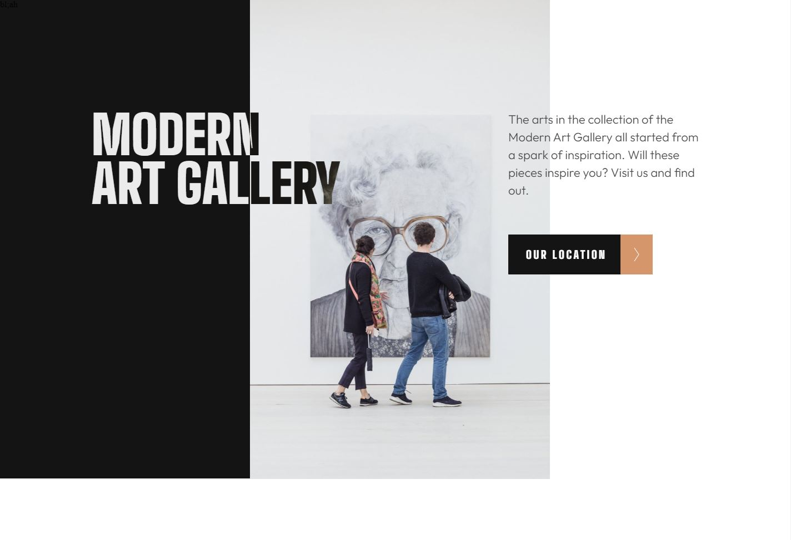

# Frontend Mentor - Art gallery website solution

This is a solution to the [Art gallery website challenge on Frontend Mentor](https://www.frontendmentor.io/challenges/art-gallery-website-yVdrZlxyA). Frontend Mentor challenges help you improve your coding skills by building realistic projects. 

### The challenge

Users should be able to:

- View the optimal layout for each page depending on their device's screen size
- See hover states for all interactive elements throughout the site
- **Bonus**: Use [Leaflet JS](https://leafletjs.com/) to create an interactive location map with custom location pin

### Screenshot

### Links

- Solution URL: [Add solution](https://github.com/DavidIrvine-TW/art-gallery)
- Live Site URL: [live site](https://davidirvine-tw.github.io/art-gallery/)

## My process

### Built with

- Semantic HTML5 markup
- CSS custom properties
- Flexbox
- CSS Grid
- Mobile-first workflow
- Sass

## Author

- Website - [David Irvine](https://github.com/DavidIrvine-TW)
- Frontend Mentor - [David Irvine](https://www.frontendmentor.io/profile/DavidIrvine-TW)

